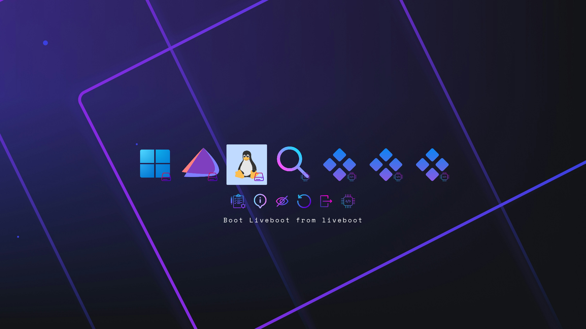

# Rectilinear

## A minimalist geometric rEFInd theme with vibrant purple motif

### Usage

1.  Locate your refind EFI directory. This is commonly `/boot/EFI/refind`
    though it will depend on where you mount your ESP and where rEFInd is
    installed.

2.  Create a folder called `themes` inside it, if it doesn't already exist

3.  Clone this repository and place `rectilinear` subfolder into the `themes` directory.

4.  The `utils` folder only serves to allow wider font generation than the rEFInd included `mkfont.sh` script
    (you are free to use it to update the font if desired)

5.  To enable the theme add `include themes/rectilinear/theme.conf` at the end of
    `refind.conf`.

6.  You may need to change the default resolution of the rEFInd menu (see refind.conf).
7.  The background can easily be replaced by any .png-file with an ideal resolution of 1920x1080.

Entries should be autodetected and shown with the proper icons.

Manual entries can be done via `menuentry` option (see refind.conf for examples).

### Attributions

> This theme is based on the [rEFInd-glassy](https://github.com/Pr0cella/rEFInd-glassy) theme.

> Inherits some OS Icons from [munlik's](https://github.com/munlik/refind-theme-regular) repository.
